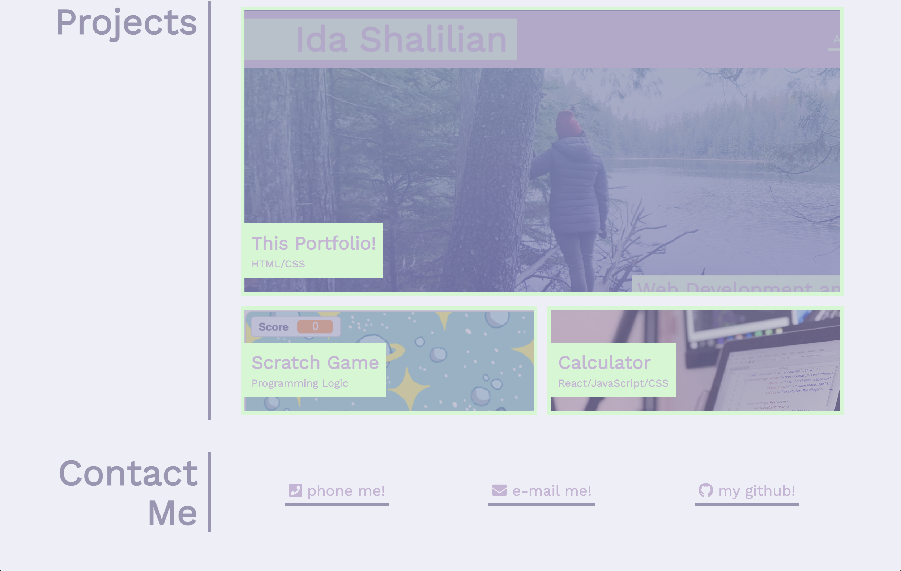

# My Portfolio

This is the github repo that will be my portfolio. As of March 12, I hardly have any projects to my name (hence the placeholder and commented out code). However, as my bootcamp goes on, I will be updating the website frequently.

I'm hoping to revamp the entire thing soon, but since I don't have much to show, I think the layout suffices for the time being. Once we learn more JavaScript, I'm excited to see the combinations I can create!

## 🔗💌 [Link to the Portfolio](https://corgimaman.github.io/portfolio/)

### Version History:

Version 1:

